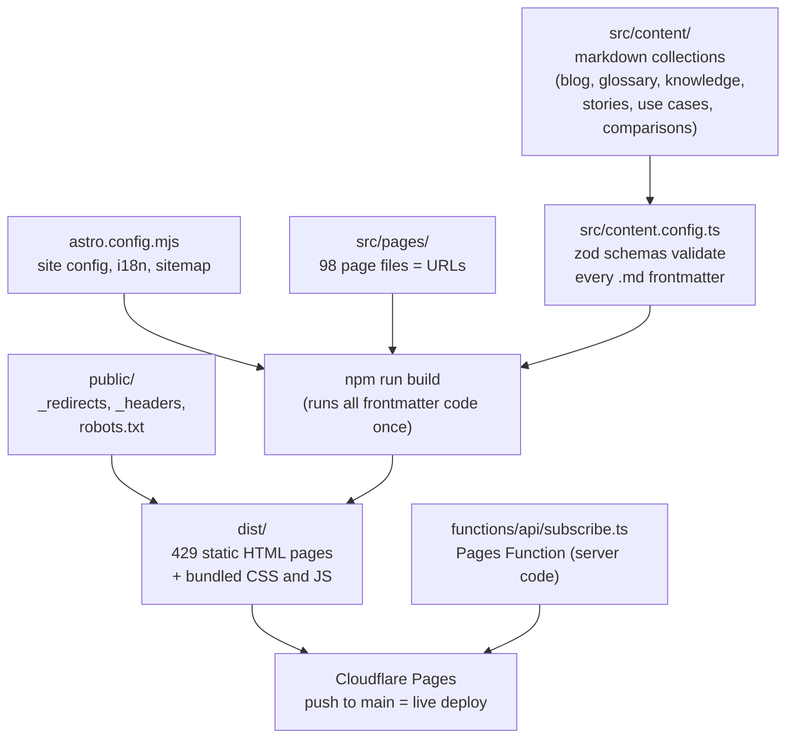
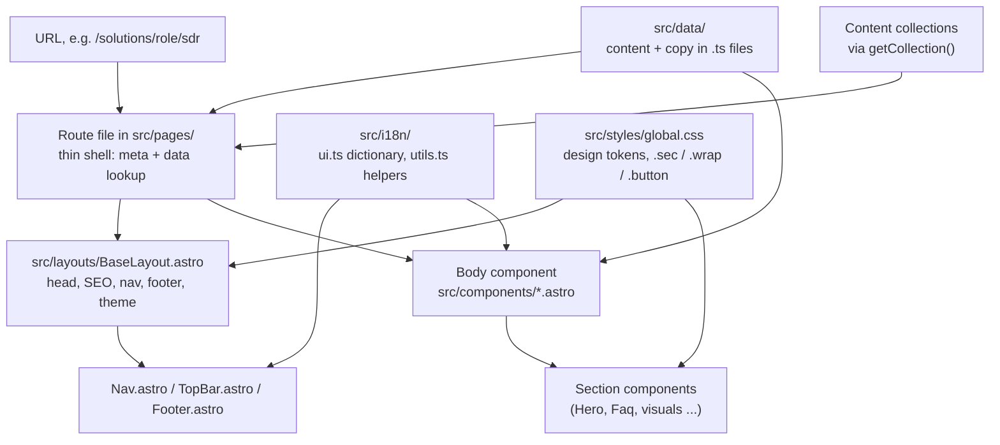
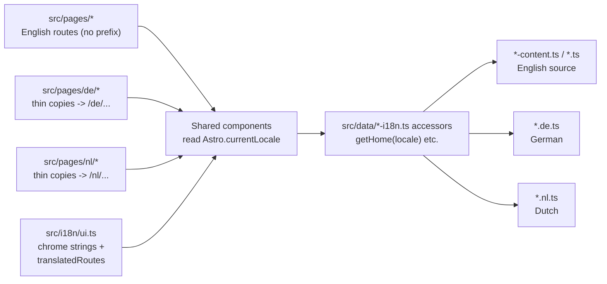
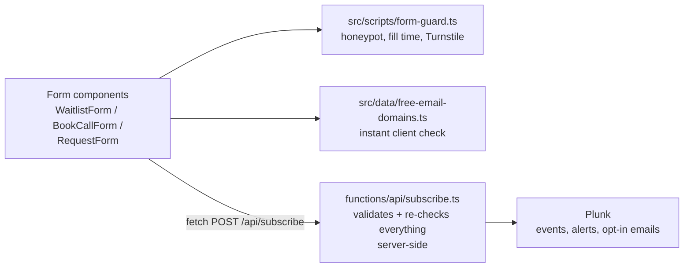
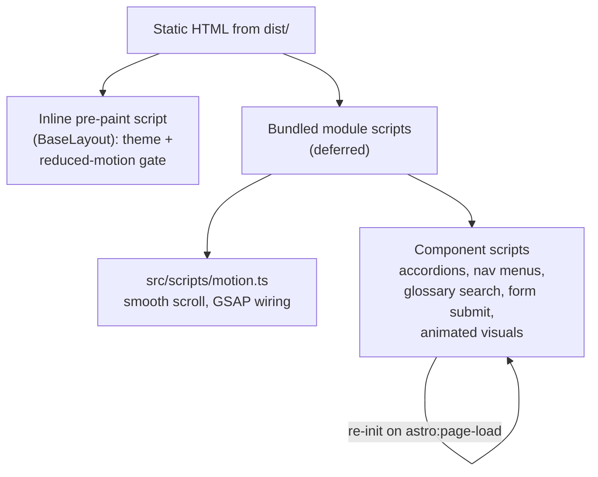

# Codebase flow chart

_Created 2026-07-24. A visual map of how the pieces of this repo fit together, from a request to a built page. Companion to `docs/20260724-1100-LEARNING-ASTRO.md` (reading order) and `docs/HANDOFF.md`. Renders on GitHub and in any Mermaid-capable markdown viewer._

## 1. The build: from source to live site

How `npm run build` turns the repo into the static site Cloudflare serves.

## 2. How one page gets rendered

The layered anatomy shared by every page in the repo.

## 3. Languages: one codebase, three locales

## 4. Forms: the only server round trip

## 5. Browser-side behavior on a built page

## Not part of the site build

- `scripts/*.mjs`: one-off Node utilities run by hand (`npm run <name>`); nothing on the site imports them.
- `src/embeds/*.html`: raw Webflow widget exports kept as reference; the live visuals are the rebuilt components.
- `docs/`: working documentation for founder and chats.
