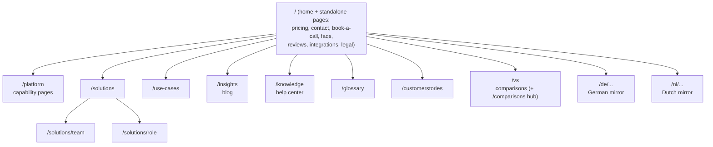

# hubsell.com — full site map and migration plan

Two parts: the **target site map** (every page a complete site in our market should
have) and the **migration plan** (moving the Webflow site onto Astro). The migration
is COMPLETE: as of 2026-06-30 the DNS cutover is done and www.hubsell.com serves the
Astro site on Cloudflare Pages. Webflow is legacy (rollback only).

Last updated: 2026-07-24 (added the folder-level flow chart; statuses last refreshed 2026-07-14 against the repo; the GitHub repo and its git log are the source of truth)

Status: **Live** = built in Astro and serving · **Not built** = standard for the market, candidate for the post-migration roadmap. (Nothing is "In migration" any more; the content move is finished.)

Market reference for "complete site": Apollo, ZoomInfo, Cognism, Lusha, Seamless. The header was restructured (2026-06-28) toward that shape: a Resources mega-menu (Blog and Case studies live; Resource center, Events, AI sales coach, Free tools, GTM plays, Help center, About us, Careers, Partner program and Newsroom shown greyed as "Soon"), a Pricing link, a Start free trial button, and a slim top utility bar holding the language control, a light/dark toggle and Log in. Top-level Products, Solutions, Our Data and GTM Developers menus are a later pass. Most of the product, solutions, resources and company pages below are still gaps.

---

## Site structure flow chart (folders only)

_Added 2026-07-24. URL sections, not individual pages; see the tables below for per-page status. `/de/...` and `/nl/...` mirror the same structure for the routes listed in `translatedRoutes` (src/i18n/ui.ts)._

---

## Part 1 — Target site map

### Home
| Path | Status | Notes |
| --- | --- | --- |
| `/` | Live | 11 sections: hero (5 grouped cards linking to pipeline stages), logo shelf (static, hand-picked), comparison, problem, sourcing, ratings, pipeline, pricing, testimonials, FAQ, insights. Use-cases, features, and publish-track-beta sections are hidden until their pages ship |

### Product
A complete site has a product overview plus a page per capability. Today these exist only as homepage sections.
| Path | Status | Notes |
| --- | --- | --- |
| `/platform` | Live | Product overview (EN/DE/NL) |
| `/platform/live-data` | Live | Live-sourced, verified-at-source contact data |
| `/platform/multichannel-outreach` | Live | Email, LinkedIn, and phone sequences |
| `/platform/crm-sync` | Live | CRM integration and two-way sync (Salesforce, HubSpot, Pipedrive) |
| `/platform/deliverability` | Live | Inbox health and sending |
| `/platform/personalization` | Live | Personalized outreach at scale |
| `/platform/enrichment` | Live | Prospecting and data enrichment |
| `/integrations` | Live | Stub page for now |

### Solutions and use-cases
The use-cases overview and four detail pages are live (English, German, Dutch). Solutions-by-audience pages are still gaps.
| Path | Status | Notes |
| --- | --- | --- |
| `/use-cases` | Live | Overview |
| `/use-cases/outbound-sales` | Live | |
| `/use-cases/lead-generation` | Live | |
| `/use-cases/multichannel-outreach` | Live | Email and LinkedIn sequences |
| `/use-cases/account-based-outreach` | Live | Covers the account-based-marketing angle |
| `/use-cases/market-expansion` | Not built | Maps to the Staffbase story |
| `/solutions` | Live | Overview of team and role pages (EN/DE/NL) |
| `/solutions/team/sales-teams` | Live | Also: `/solutions/team/agencies`, `/solutions/team/revops`, `/solutions/team/founders` |
| `/solutions/role/sdr` | Live | Reworked layout live (animated hero visual, pains with alternating layout, single email CTA with compact modal form); founder prune pass and meta rewrite pending, see docs/HANDOFF.md. Also: `/solutions/role/sales-leader`, `/solutions/role/sales-operations`, `/solutions/role/marketing` |

### Pricing
| Path | Status | Notes |
| --- | --- | --- |
| `/pricing` | Live | Standalone page (EN/DE/NL): plan widget, expandable per-node comparison, FAQ. Nav and footer point to it |

### Customers
| Path | Status | Notes |
| --- | --- | --- |
| `/customerstories` | Live | Overview (linked in the nav Learn menu). English, German, Dutch |
| `/customerstories/<slug>` | Live | 6 stories: safran, staffbase, verhaert, elium, workspace365, sensolus |
| `/hubsell-reviews` | Live | Testimonials + per-platform ratings; carries Review schema |
| `/customers` | Not built | Logo wall, optional. We have 60+ customer logos on R2. The new homepage static shelf could inform its design |

### Resources
| Path | Status | Notes |
| --- | --- | --- |
| `/insights` | Live | Blog overview. English only (served to de/nl via fallback; nav/footer label it "Insights (EN)" in non-English). The 87 post titles were rewritten for search keywords, with topic tags and related-post links |
| `/insights/<slug>` | Live | 87 posts, one shared template. English only |
| `/faqs` | Live | Full FAQ page (also feeds the homepage FAQ section); carries FAQPage schema |
| `/ai-information-page` | Live | Plain-language overview written for AI assistants (AEO) |
| `/guides` | Not built | Playbooks and ebooks |
| `/templates` | Not built | Outreach email and sequence templates |
| `/knowledge` | Live | Knowledge center hub (product help / onboarding). English only, de/nl via fallback stubs. Client-side search, grouped by category. Linked in the nav Learn menu. See `docs/KNOWLEDGE-CENTER.md` |
| `/knowledge/<slug>` | Live | 6 articles: the complete 5-step "First login to first campaign" series (set-up, mailbox+LinkedIn, sourcing, CRM, create-a-flow) plus data-enrichment (Data). TechArticle + BreadcrumbList + FAQPage schema, click-to-load Scribe walkthrough, "Last updated" date |
| `/glossary` | Live | A-to-Z dictionary, 66 terms (EN/DE/NL), built in 5 batches |
| `/tools` | Not built | Free tools, for example email verifier or ROI calculator |
| `help.hubsell.com` | Not built | Help center or docs subdomain. Interim product help now lives at `/knowledge` (see above) |

### Compare
| Path | Status | Notes |
| --- | --- | --- |
| `/comparisons` | Live | Overview of all comparisons. English, German, Dutch |
| `/vs/apollo` | Live | Linked from the comparison section |
| `/vs/zoominfo` | Live | |
| `/vs/cognism` | Live | |
| `/vs/lusha` | Live | |
| `/vs/seamless` | Live | |
| `/alternatives` | Not built | Comparison hub, optional |

### Company
| Path | Status | Notes |
| --- | --- | --- |
| `/about` | Not built | A PageLayout exists, needs founder content |
| `/contact` | Live | Contact form. English, German, Dutch |
| `/careers` | Not built | Or an external job board |
| `/security` | Not built | Security, compliance, GDPR. Important for a data company |
| `/partners` | Not built | Optional |
| `/press` | Not built | Optional |

### Get started
| Path | Status | Notes |
| --- | --- | --- |
| `/book-a-call` | Live | Book-a-call / demo request form. Trial CTAs currently point here. English, German, Dutch |
| `/demo` | Not built | Could alias to `/book-a-call` |
| `app.hubsell.com` (Login) | Live | External app |
| `app.hubsell.com/signup` (Trial) | Not built yet | Signup page not live; every "Start free trial" button is temporarily routed to `/book-a-call` via the `SIGNUP_URL` constant until it ships |

### Legal
| Path | Status | Notes |
| --- | --- | --- |
| `/legal-notice` | Live | English (imported verbatim; not machine-translated) |
| `/privacy` | Live | English |
| `/terms` | Live | English |
| `/data-processing-agreement` | Live | English |
| `/affiliate-terms-and-conditions` | Live | English |
| `/cookies`, `/sub-processors` | Not built | Sometimes split out, optional |

### Utility
| Path | Status | Notes |
| --- | --- | --- |
| `sitemap.xml` | Live | Generated automatically (sitemap-index.xml) |
| `robots.txt` | Live | |
| `/llms.txt` | Live | Curated site map for AI answer engines (AEO) |
| `/404` | Live | Custom 404 page |
| Search | Not built | Optional |

---

## Part 2 — Migration plan (Webflow to Astro) — COMPLETE (historical record, kept as-is)

The Webflow content was moved onto Astro, path for path, and the DNS cutover is done.
www.hubsell.com now serves the Astro site. Webflow is retained only as a rollback.

### Phases
| Phase | Scope | Status |
| --- | --- | --- |
| 0 | Foundation: scaffold, BaseLayout, Nav, Footer, design system, motion | Done |
| 1 | Legal: 4 pages through a shared layout | Done |
| 2 | Insights blog: collection, overview, 87 posts | Done |
| 3 | Customer stories: collection, overview, 6 stories | Done |
| 4 | Competitor `/vs` pages: 5 pages | Done |
| 5 | Cleanup: content pass, image and R2 cleanup, loose ends | In progress |
| 6 | DNS cutover: point hubsell.com at Astro | Done |

The header redesign (top utility bar, light/dark toggle, Resources mega-menu, mobile menu) landed 2026-06-28, outside the content phases. Internationalization was scoped and parked the same day, then resumed (see the i18n section below).

Landed 2026-06-30, outside the content phases: a full SEO and AEO/GEO pass (JSON-LD structured data site-wide, covering Organization, WebSite, SoftwareApplication, FAQPage, Article, BreadcrumbList and Review; `public/llms.txt`; a default Open Graph image at `assets.hubsell.com/brand/og-default.png`; title normalization and `og:type` handling); the DNS cutover itself; Reviews and AI information moved into the footer Company column; a dark-mode fix on the Zero-day timeline; and all "Start free trial" buttons temporarily routed to `/book-a-call` via the `SIGNUP_URL` constant until the signup page ships. German (`/de/`) was also completed and merged around this date.

Landed 2026-07-01, outside the content phases:
- Dutch (`/nl/`) locale built across all page types (see the i18n section). Full build 166 pages. Go-live is a merge of branch `i18n-nl` into `main`; confirm it has been done and Dutch is live on production.
- Homepage logo section changed from an auto-scrolling marquee (about 66 logos) to a static, hand-picked "shelf" (styled after salesforge.ai): a bordered strip of divided cells. The 5 companies with a published customer story sit on the top row, each linked to its story with a small corner-arrow indicator; 5 more logos sit plain on the bottom row (GLS, FABs, ipushpull, Kapturall, Monotype). One self-localising component (`CustomerLogos.astro`) used on all three homepage locales. Delivered as a tarball; confirm it is applied.

### Open migration actions
- [x] Export the Webflow "Comparisons" collection as CSV, then build the 5 `/vs` pages (Phase 4)
- [x] Repoint any remaining Webflow CDN images to R2 (no Webflow CDN images remain referenced in `src`)
- [x] Decide whether to link the `/customerstories` overview in the nav or footer (it is in the nav Learn menu)
- [x] Custom 404 page
- [x] DNS cutover
- [ ] Move the Sensolus and Staffbase champion photos to R2 (Peter, Eylul); confirm they now load from R2, not Webflow
- [ ] R2 cleanup: sweep about 19 size-variant leftovers at the bucket root; confirm the 3 logo SVGs and `brand/og-default.png` are live
- [ ] Place the "Ask AI about hubsell" widget (`AskAiWidget.astro` exists, not on any page)
- [ ] Content pass for copy drift (Webflow is gone; compare against the live Astro site or an archived copy)
- [ ] Revert `SIGNUP_URL` to the real signup URL once the signup page is live

### After migration (now)
The site is on Astro, so the "Not built" pages in Part 1 are the active roadmap:
a standalone `/pricing`, the `/platform` product pages and `/integrations`, more
solutions and use-cases, a `/customers` logo wall, company pages (`/about`,
`/security`, `/careers`), and more resources (guides, glossary, tools). Plus the
remaining locales (fr, es, pt). See the companion handoff for the prioritized backlog.

---

## Internationalization (i18n) — German live, Dutch built

Multilingual support was scoped and parked (2026-06-28), then resumed. German shipped
first (2026-06-30) and is live under `/de/`. Dutch was built next (2026-07-01) and is
ready to ship under `/nl/`. The remaining languages (French, Spanish, Portuguese) are
not built yet. The original findings and agreed shape are kept below; the "What shipped"
and "Current state" subsections describe where things stand now.

### What shipped (German live 2026-06-30, Dutch built 2026-07-01)
Astro built-in i18n is live. English stays at the root (no prefix); German and Dutch are
served under `/de/` and `/nl/`, with a per-page fallback that redirects any untranslated
locale path to its English version (so nothing 404s). hreflang (en/de/nl/x-default) is
emitted only where the page exists. Hand-translated by Claude, all building and verified
on the preview, for both German and Dutch:
- UI chrome (nav, top bar, footer), the full homepage (14 sections) and its embeds
- Contact and Book-a-call forms
- FAQs, Reviews (`/de|nl/hubsell-reviews`), the AI information page
- Use cases: overview + all 4 detail pages
- Comparisons: overview + all 5 `/vs` pages
- Customer stories: overview + all 6 stories

Register is formal (German *Sie*, Dutch *u*); the brand stays lowercase "hubsell"; figures,
prices, URLs and source citations are kept verbatim, with per-locale number and date
formatting. Job titles in customer stories stay English. Third-party review quotes and
customer testimonials were translated (revert to verbatim English on request). The
"no AI-sounding words" copy rule is applied in the target language too (a buzzword is
rendered in plain target-language wording, not carried across as a loanword).

**Insights/blog stays English for now.** The 87 blog posts are not translated (the volume
reason below still holds), so `/de|nl/insights/...` resolves to the English posts via the
fallback. To make this explicit, the Insights item in the nav and footer reads
**"Insights (EN)"** in every non-English language, and plain **"Insights"** in English.
Legal pages also stay English (imported verbatim on purpose).

Full build is 166 pages.

### Languages
Six locales are defined; the switcher only offers the ready ones.
- English (UK) — base / current, `en-GB` — **live**
- German — `de` — **live** (complete, 2026-06-30)
- Dutch — `nl` — **built, ready to ship** (complete, 2026-07-01; go-live is the `i18n-nl` merge to `main`)
- French — `fr` — not built; hidden from the switcher for now
- Spanish — `es` — not built; hidden from the switcher for now
- Portuguese (Brazil) — `pt-BR` — not built; hidden from the switcher for now

### Volume (why the blog is excluded)
Word counts on the current content:
- Blog: about 199,000 words across the 87 posts (average ~2,400 per post; 12 posts run past 4,000 words).
- Customer stories: about 6,000 words across the 6 stories.
- UI chrome, homepage and key marketing pages: about 2,000 words.

Translating the whole site into the five non-English languages is roughly a million
words of output. The blog is the blocker: that volume cannot be hand-translated inside
a chat session, so it stays English with the fallback.

### Approach for the remaining locales (fr, es, pt)
1. Framework: Astro built-in i18n (already built). One URL per language, the switcher wired
   into the top-bar language control, hreflang tags, per-locale content collections, and a
   per-page fallback to English. Internal links are already locale-aware via `localizedHref`.
2. Hand-translated by Claude (bounded, high value): the UI chrome, the homepage, the key
   marketing pages, and the 6 customer stories. This is the conversion-critical content.
   Same six-batch split Dutch used.
3. The 87 blog posts: stay English via the fallback. A one-time machine run (a script Claude
   writes, the founder runs against a translation API such as DeepL or Google) is the option
   if full blog translation is ever wanted.
4. Legal pages: do NOT machine-translate. They stay English unless translated professionally.

### Current state
The framework is built. German is live under `/de/`; Dutch is built and ready under `/nl/`
(go-live is the merge to `main`). The top-bar language selector offers English, Deutsch and
Nederlands as real links (each pointing to the translated page where it exists, English
otherwise). French, Spanish and Portuguese are parked and hidden from the selector until
their translations are done. Insights/blog and the legal pages remain English (served to
German and Dutch visitors via the fallback).

---

## Reference
- Live: www.hubsell.com on Cloudflare Pages (output `dist`, Node 20), apex redirects to www. Preview builds at hubsell-website.pages.dev. Production deploys on a push to `main`.
- Images: Cloudflare R2 at `assets.hubsell.com` (folders: `insights/`, `avatars/`, `customers/`, `logo/`, `logos/`, `brand/`)
- CMS source: Webflow exports each collection as CSV; converters in `scripts/` turn them into Astro content collections. Webflow is legacy (rollback only); never write to it.
- SEO/AEO: JSON-LD via `src/components/JsonLd.astro` + `src/data/seo.ts`; `public/llms.txt`; default OG image `brand/og-default.png`.
- i18n: `src/i18n/ui.ts` (switcher locales, translated-routes registry, chrome dictionaries), `src/i18n/utils.ts` (locale helpers), `src/i18n/pages.ts` (per-page copy), `src/data/home-i18n.ts` + `home.de.ts` + `home.nl.ts`, per-locale content collections in `src/content/config.ts`. `astro.config.mjs` declares all six locales with an English fallback.
- URL paths match the old live site exactly.
